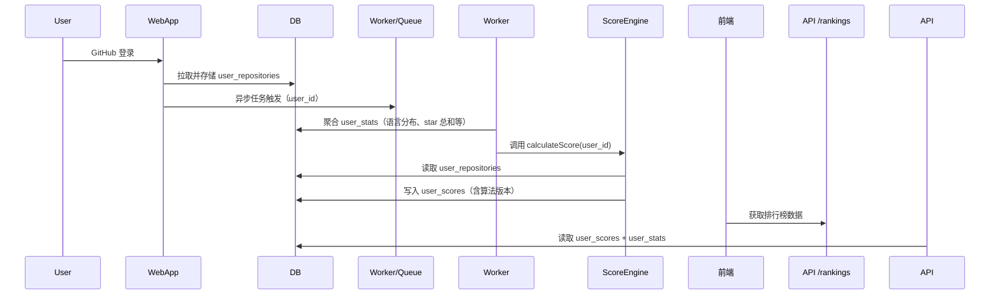

我希望设计一个最简单版本的算法，但是要可扩展。可以参考以下内容，结合自己项目的表结构和实际情况 来。

* 原始用户数据存在数据库中，**不变动**；
* 每次用户登录后，异步**统计并缓存衍生数据**（如 star 总数、语言分布等）；
* 排行榜基于“某种评分算法”来排序，但这个算法会频繁调整，因此必须：

    * 将算法逻辑**抽象成接口**；
    * 方便日后更换评分逻辑而**不动数据库结构**。


---

## ✅ GAIDN 用户数据分析与排行榜系统设计概要

### 一、原始数据存储

所有用户仓库原始数据存在表 `user_repositories`，此表结构固定不变，作为算法的基础数据层：

每位用户最多保存最近 100 个仓库（按 GitHub API 限制）。

---

### 二、异步统计衍生数据（登录后触发）

用户登录完成 GitHub 授权后，系统应异步执行以下操作：

* 聚合原始数据，生成用户的衍生信息，存入 `user_stats` 表；
* 计算评分，存入 `user_scores` 表（供排行榜使用）；

#### `user_stats`（统计性数据，主要用于展示）

```sql
user_stats (
  user_id INT,
  total_repos INT,
  ai_repos INT,                   -- 被判定为 AI 项目的仓库数
  stars_sum INT,
  forks_sum INT,
  language_distribution JSON,     -- 各语言出现次数，如 {"Python": 5, "TypeScript": 3}
  last_updated DATETIME           -- 最新更新时间（所有仓库的 max(updated_at)）
)
```

---

### 三、评分系统（支持热插拔算法）

评分系统应被设计为 **策略模式 / 插件式架构**，即：

* 提供一个抽象接口 `calculateScore(user_id): number`
* 实际评分逻辑封装为不同版本（如 `ScoreV1`, `ScoreV2`）
* 后续修改评分逻辑只需更换实现，不影响其他部分

评分计算后的结果存入 `user_scores` 表：

```sql
user_scores (
  user_id INT,
  score FLOAT,
  algorithm_version TEXT,         -- 当前评分所用的算法版本名（如 "V1"）
  calculated_at DATETIME
)
```

---

### 四、排行榜接口读取方式

排行榜查询接口读取 `user_scores` 表，按 `score DESC` 排序，关联用户基本信息和 `user_stats` 作为展示：

* 支持分页（offset / limit）
* 可显示字段包括：

    * 用户名 / 头像（通过 GitHub API 拿）
    * GAIDN\_SCORE
    * AI 项目数
    * 总 Star / Fork 数
    * 最近活跃时间

---

### 五、执行流程（摘要）



---
注意，编码规范：类型强安全，避免 any，接口要有返回。
架构清晰解耦，具体可以看 claude.md 里面的内容